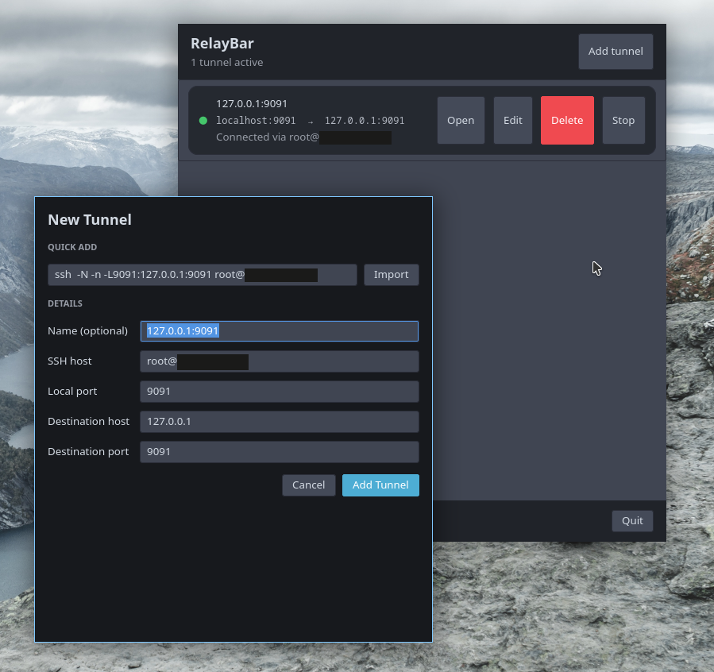

# RelayBar

A small GTK app for keeping SSH local forwards in one place.



Paste a command such as:

```sh
ssh -N -L 8080:localhost:3000 user@example.com
```

RelayBar imports the tunnel, saves it, and lets you start or stop it from the window. It can also open the local address in your browser once SSH connects.

RelayBar runs `/usr/bin/ssh` directly. It does not invoke a shell, and imported SSH options are checked against a small allowlist.

## Install

You need Rust and the GTK 4 development files.

```sh
cargo install --git https://github.com/skorotkiewicz/RelayBar --locked
relaybar-rs
```

## Development

```sh
just run
just test
```

Tunnel definitions are stored in `$XDG_CONFIG_HOME/relaybar/tunnels.json`, or `~/.config/relaybar/tunnels.json` when `XDG_CONFIG_HOME` is unset.
